
<h1 align="center">基于JavaEE的传统文化学习系统的设计与实现</h1>

## 简介
传统文化学习系统：角色分为管理员、用户；功能包括文化中心管理、用户管理、文化类别管理、留言板和公告发布等，提高用户传统文化的学习和交流体验。    --计算机毕业设计源码；毕设源码；java毕业设计源码

## 联系方式

<h3 align="center">获取完整代码与数据库文件 + 微信：deepguan QQ: 86050149 QQ群: 783742310</h3>

<h3 align="center">可帮忙远程部署 包运行成功！提供远程部署、修改代码、设计文档指导、代码讲解等服务！</h3>

## 功能介绍（完整见运行截图）
管理员：用户管理、文化类别管理、学习记录管理、公告信息发布、留言板管理。支持用户信息编辑、积分增加、批量删除、文化内容管理，包括新增、修改、删除和查看功能。

用户：注册、登录、个人信息编辑，上传头像，查看学习记录，参与留言互动。可浏览文化详情、观看视频、提交评论以及获取公告信息和文化介绍。

访客：访问首页，浏览文化中心内容，查看公告信息和留言板。支持基础留言互动，了解传统文化背景及相关资源。

系统：提供多媒体文化学习体验，支持文化内容展示、信息管理及交互功能，通过视频、图片、文字等形式增强传统文化的传播与学习。

## 运行截图
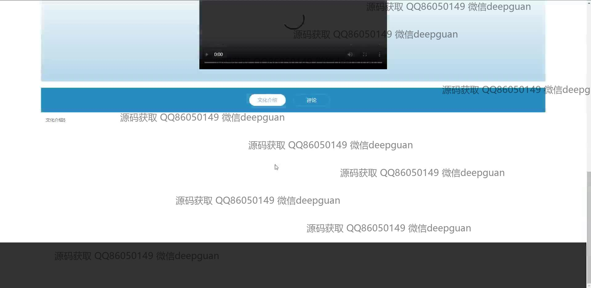
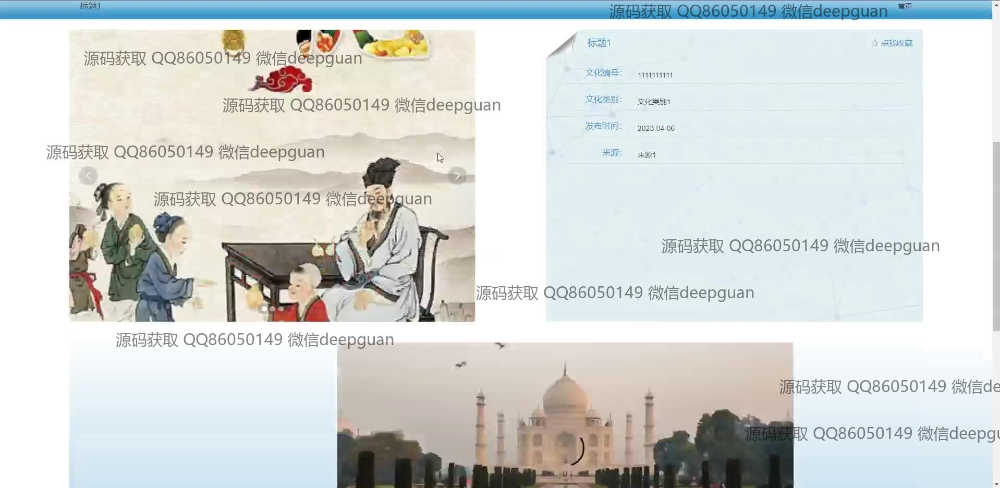
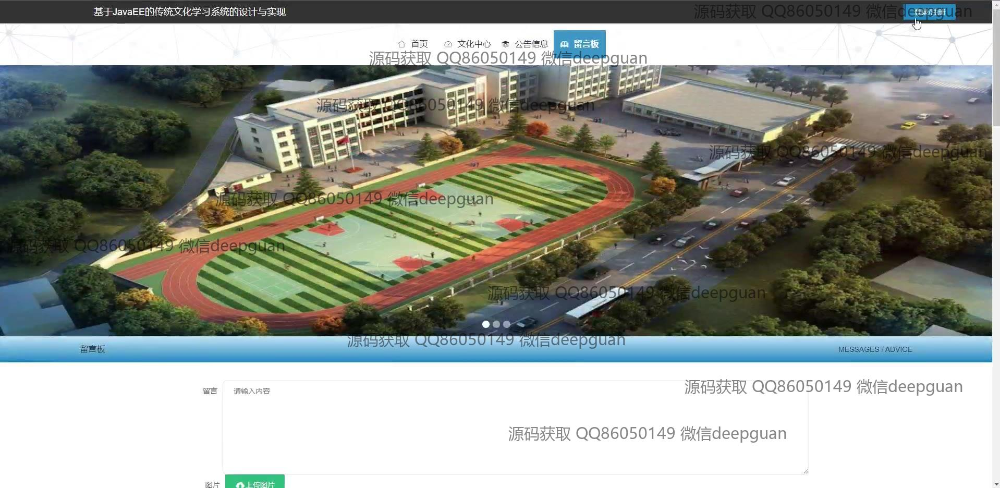
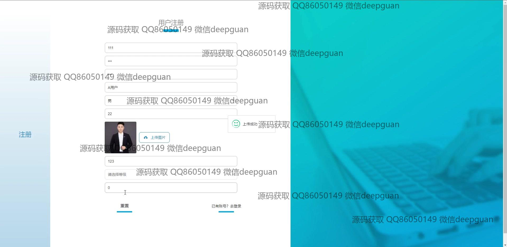
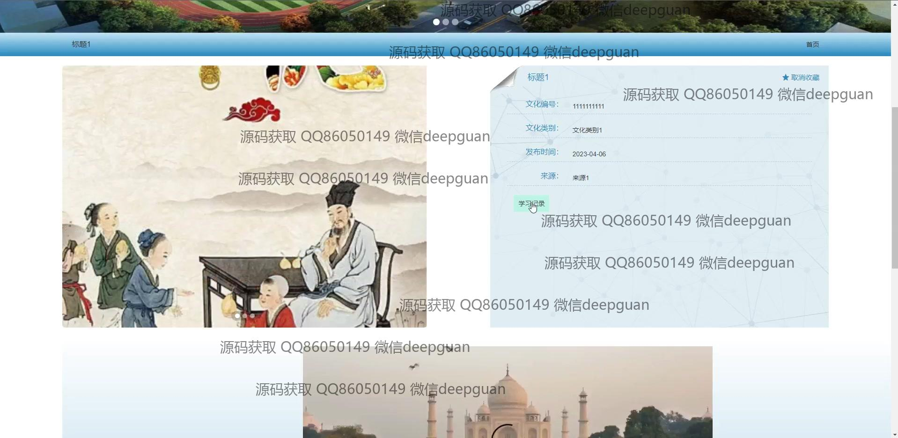
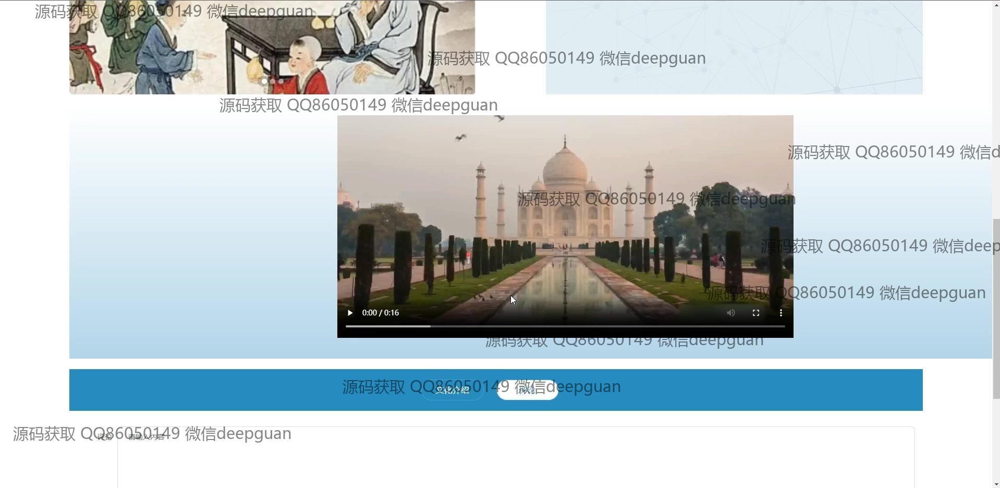

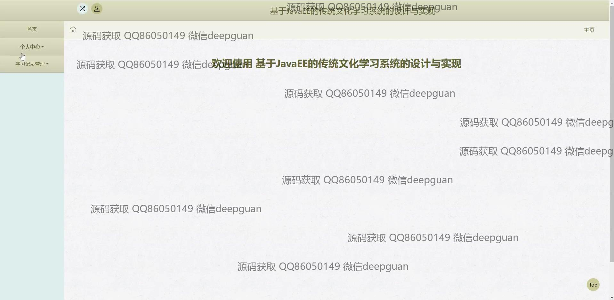
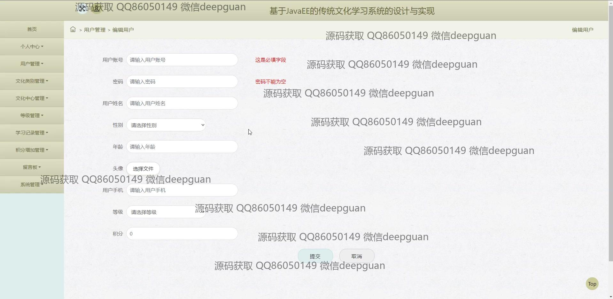
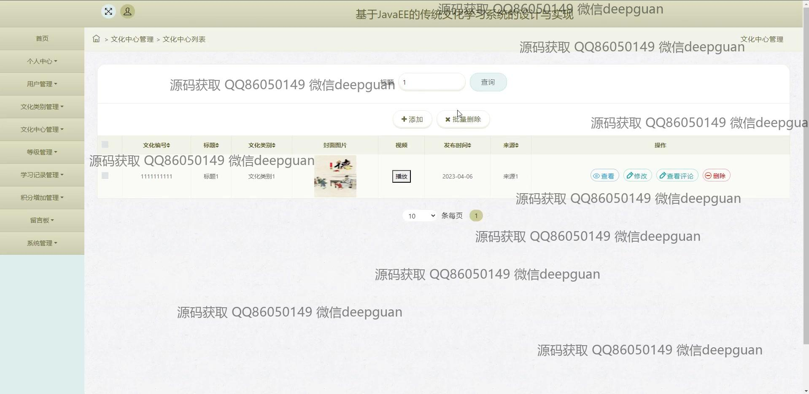
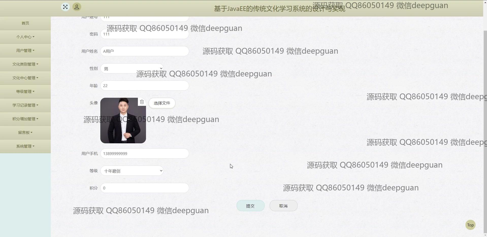
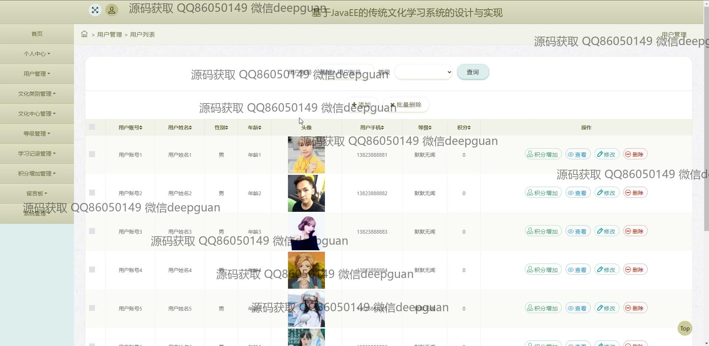
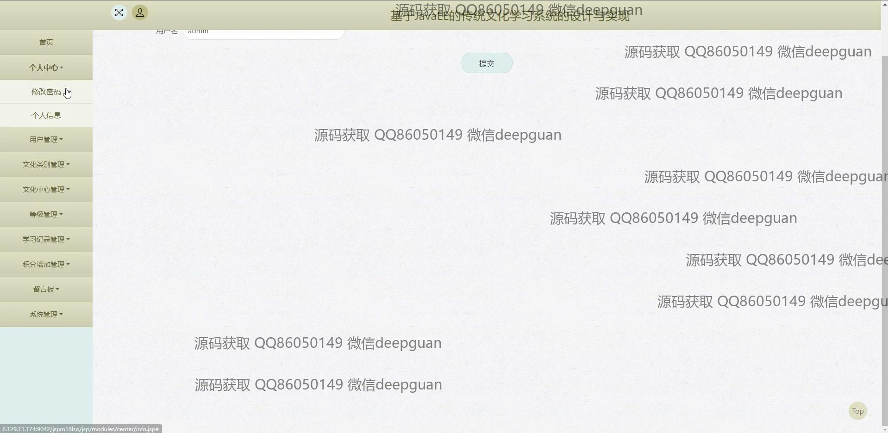
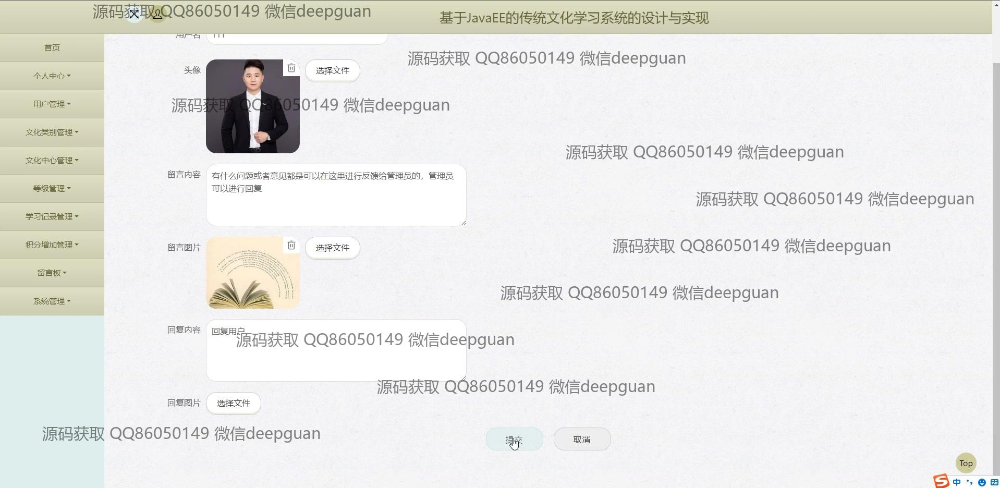
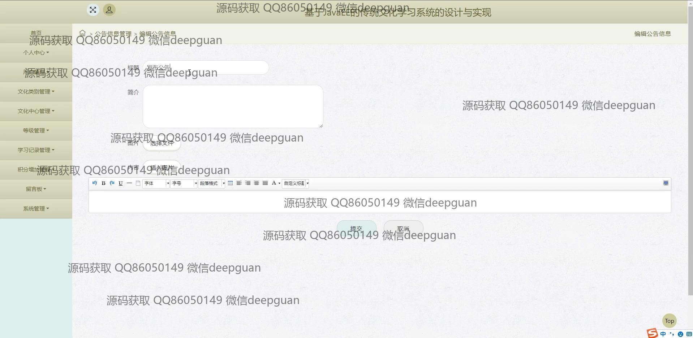

本代码来源于网络,仅供学习参考使用!

